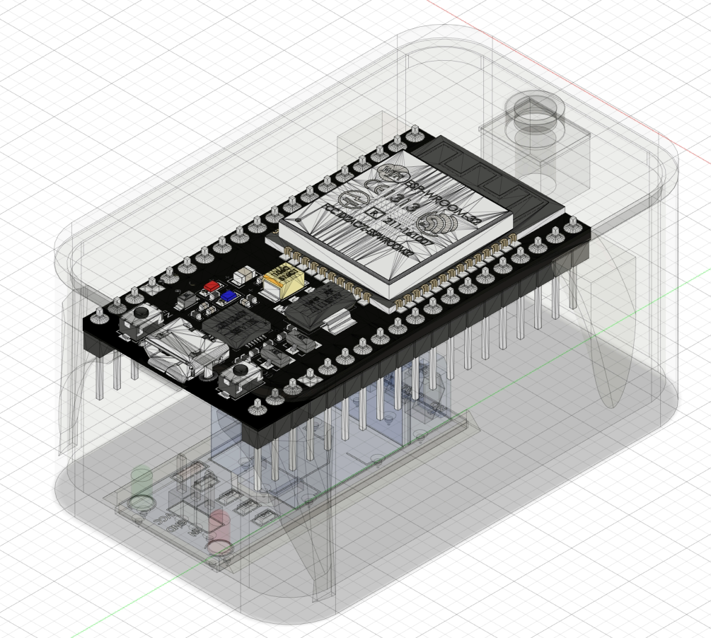
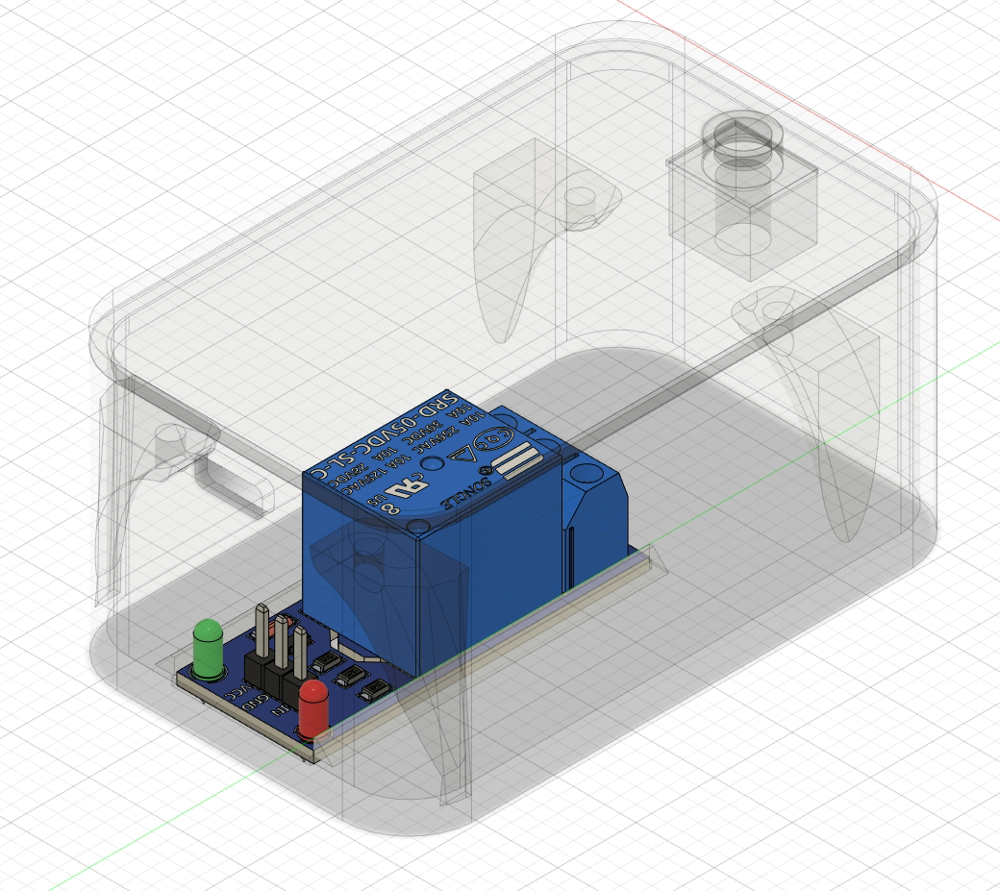
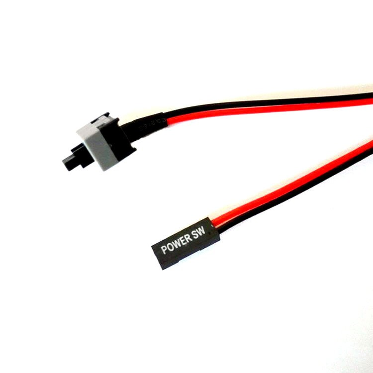
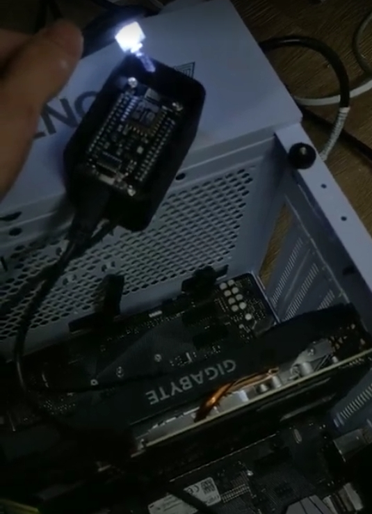

# esp8266-remote-power-button

Remote PC power-on **over the Internet** by emulating a **physical press of the PC power button** (Power SW) using an **ESP8266 + relay**, controlled from **Google Sheets** via **Google Apps Script**.

> This is **NOT Wake-on-LAN (WOL)**.  
> No BIOS WOL setup is required, because it electrically shorts the **Power SW** header (same as pressing the case power button).

---

## Demo Videos

### 1) IoT Server–based Remote Power-On Demo

### 2) Google Sheets–based Remote Power-On Demo

---

## What it does

- ESP8266 connects to your Wi-Fi
- Periodically polls a Google Apps Script (HTTPS)
- Script reads a value from Google Sheets (control panel)
- When the value changes, ESP8266 triggers a relay pulse
- Relay shorts the **Power SW** header briefly
- PC powers on exactly like a real button press

---

## Why this approach

Most “remote power on” guides require:

- Port forwarding
- DDNS
- VPN
- NAS / Home Assistant

This project requires **none** of them.

The ESP8266 only makes **outbound HTTPS requests**, so it works behind **NAT / CGNAT** safely.

---

## Architecture

  

---

## Hardware

### ESP8266 (NodeMCU / Wemos D1 mini)

  

### 1-channel relay module (opto-isolated recommended)

  

### Wiring to motherboard Power SW header (parallel with case button)

  

### Final assembly

  

> The Power SW header is a **low-voltage momentary switch input** on the motherboard.  
> **Do NOT** connect mains voltage. **Do NOT** modify PSU wiring.

---

## Setup (High Level)

### 1) Google Sheets

Create a sheet that stores a control value, for example:

- `0` = idle
- `1` = trigger power press

A timestamp or counter also works — anything that **changes**.

---

### 2) Google Apps Script (Web App)

- Paste `server/google_apps_script/Code.gs` into Apps Script
- Set your `SPREADSHEET_ID` (and sheet name if needed)
- Deploy as **Web App** (HTTPS URL)

Recommended: add a simple shared secret, e.g. `?key=YOUR_SECRET`.

---

### 3) ESP8266 Firmware

- Copy `config.example.h` → `config.h`
- Fill in:
  - Wi-Fi SSID / password
  - Apps Script Web App URL (and optional secret)
- Flash the `.ino` to ESP8266

---

## How the Trigger Works

- ESP8266 reads the value from the API
- If the value differs from the previous read → trigger relay pulse
- Pulse duration adjustable (200–1000 ms typical, some boards need 1–2 s)

---

## FAQ

**Q: Is this Wake-on-LAN?**  
A: No. It emulates a physical press of the motherboard Power SW header.

**Q: Do I need to enable WOL in BIOS?**  
A: No.

**Q: Do I need port forwarding or DDNS?**  
A: No. Only outbound HTTPS is used.

**Q: Is it safe?**  
A: Electrically identical to pressing the case power button, if wired correctly.

---

> [!NOTE]
> - Replace placeholders with your own Sheet ID / Web App URL
> - Do NOT commit secrets (keep `config.h` private)
> - This project was originally built nearly three years ago. The original 3D model files for the enclosure have been lost. The structure is very simple — if there is real demand, feel free to contact me and I can recreate it. Contributions to restore or redesign the 3D files are also highly appreciated.

---

## License

Apache License 2.0
